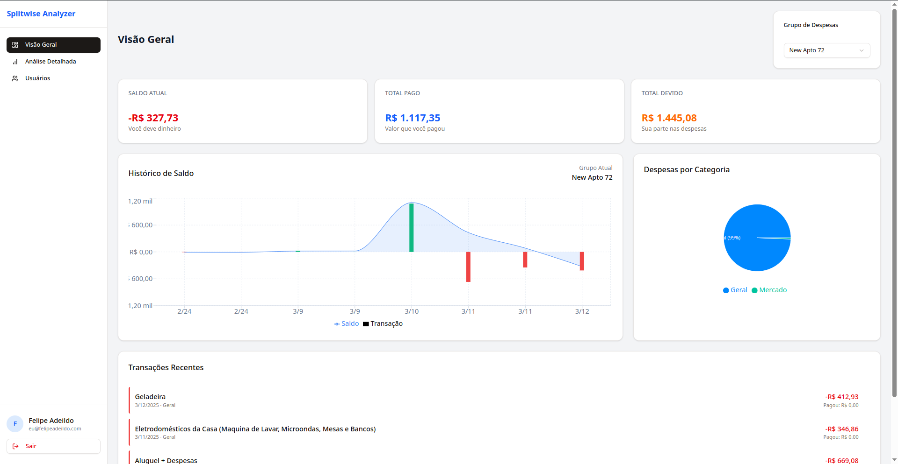

# Splitwise Expense Analyzer

Uma interface amigável e poderosa para visualizar e analisar suas despesas do Splitwise.



## 📊 Visão Geral

O Splitwise Expense Analyzer é uma aplicação web que oferece visualizações detalhadas e insights sobre suas despesas compartilhadas no Splitwise. Esta ferramenta foi desenvolvida para complementar a interface oficial do Splitwise, fornecendo uma visualização mais intuitiva que ajudam a entender melhor seus gastos compartilhados.

## ✨ Funcionalidades

- **Dashboard Completo**: Visualize seus saldos, despesas e pagamentos em um único lugar
- **Visualização por Categorias**: Entenda como seus gastos estão distribuídos por categoria
- **Histórico de Saldo**: Acompanhe a evolução do seu saldo ao longo do tempo com gráficos intuitivos
- **Análise de Dívidas**: Veja claramente quem deve a quem e quanto
- **Transações Recentes**: Lista detalhada das transações mais recentes
- **Detalhamento de Despesas**: Análise completa de como cada despesa afeta seu saldo
- **Seleção de Grupo**: Alterne facilmente entre diferentes grupos do Splitwise
- **Interface Responsiva**: Funciona perfeitamente em dispositivos móveis e desktop

## 🔧 Tecnologias

- **React**: Para uma interface de usuário reativa e performática
- **Vite**: Build tool rápida e moderna para desenvolvimento
- **TailwindCSS**: Estilização moderna e consistente
- **TypeScript**: Para um código mais seguro e manutenível
- **Recharts**: Visualizações de dados elegantes e responsivas
- **Shadcn UI**: Componentes acessíveis e personalizáveis

## 🔐 Autenticação com Cookie

Esta aplicação utiliza o cookie de autenticação do Splitwise ao invés do login tradicional via OAuth. Isso acontece porque:

1. **Bypass de Captcha**: O Splitwise implementou captchas no processo de login OAuth que dificultam o acesso programático
2. **Simplicidade de Implementação**: Permite o acesso à API sem a necessidade de registrar um aplicativo OAuth
3. **Acesso Completo**: Fornece acesso às mesmas funcionalidades que você tem na interface web do Splitwise

> **Nota de Segurança**: Seu cookie de autenticação é armazenado apenas localmente no seu navegador e é usado somente para fazer requisições à API do Splitwise. Não compartilhamos ou armazenamos este dado em nenhum servidor.

## 🚀 Como Usar

A versão produção está disponível pelo endereço [splitwise.lipe.me](https://slitwise.lipe.me).

### Instalação e Execução (Dev)

```bash
# Clone o repositório
git clone https://github.com/seu-usuario/splitwise-expense-analyzer.git

# Entre na pasta do projeto
cd splitwise-expense-analyzer

# Instale as dependências
npm install

# Inicie o servidor de desenvolvimento
npm run dev
```

### Obtendo o Cookie de Autenticação
### Obtendo o Cookie de Autenticação

Existem dois métodos para obter o cookie de autenticação:

#### Método 1: DevTools

1. Faça login no [Splitwise](https://secure.splitwise.com/) pelo navegador
2. Abra as ferramentas de desenvolvedor (F12 ou Clique com botão direito > Inspecionar)
3. Vá para a aba "Network" (Rede)
4. Atualize a página (F5)
5. Selecione qualquer requisição para splitwise.com
6. No painel de cabeçalhos, procure por "Cookie" nos cabeçalhos de requisição
7. Copie o valor completo do cookie (começa com `user_credentials=...`)
8. Cole este valor no campo de login do Splitwise Expense Analyzer

#### Método 2: Cookie Editor

1. Instale a extensão [Cookie-Editor](https://cookie-editor.com/) para seu navegador
2. Faça login no [Splitwise](https://secure.splitwise.com/)
3. Clique no ícone da extensão Cookie-Editor
4. Procure pelo cookie `user_credentials`
5. Copie o valor do cookie
6. Cole este valor no campo de login do Splitwise Expense Analyzer


## 📱 Visualizações Disponíveis

### Visão Geral
Mostra um resumo completo das suas finanças, incluindo:
- Saldo atual
- Total pago e devido
- Gráfico de timeline de despesas
- Distribuição por categoria
- Transações recentes

### Análise Detalhada
Fornece insights mais profundos sobre seus gastos:
- Detalhamento de despesas por impacto no saldo
- Análise temporal mais detalhada
- Distribuição por categoria com valores específicos

### Usuários
Foco nas relações financeiras entre os membros do grupo:
- Visualização clara de quem deve a quem
- Histórico de transações por pessoa
- Impacto de cada usuário no seu saldo

## 🤝 Contribuindo

Contribuições são bem-vindas! Sinta-se à vontade para abrir issues para reportar bugs ou sugerir melhorias, ou enviar pull requests com novos recursos ou correções.

---

**Nota**: Esta aplicação não é afiliada, associada, autorizada, endossada por, ou de qualquer forma oficialmente conectada com Splitwise, Inc., ou qualquer uma de suas subsidiárias ou afiliadas.spl